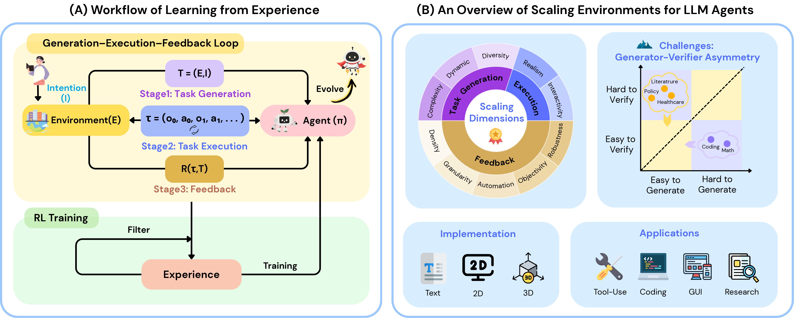
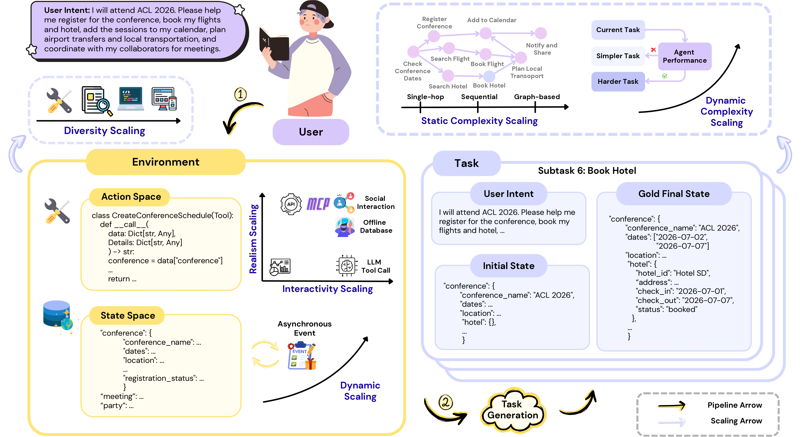
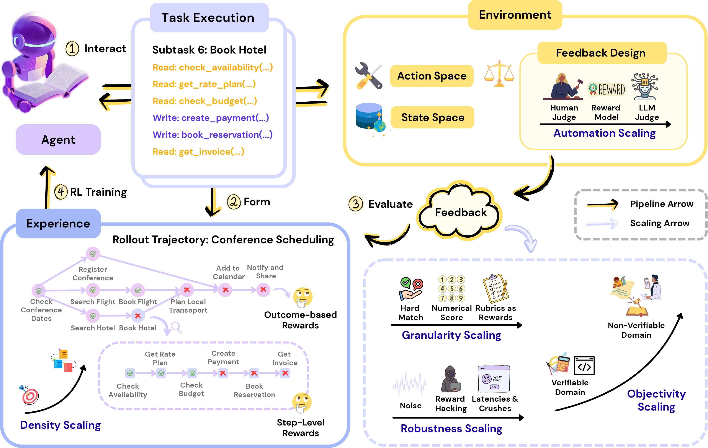

# 🏖️ Awesome-Environment-Scaling

<div align="center">
  <h1 align="center">Scaling Environments: A Crucial Step towards Agent Intelligence</h1>

  <p align="center">
    This repository accompanies our survey paper: <br>
    <a href="https://arxiv.org/abs/2511.09586"><strong>Scaling Environments for LLM Agents in the Era of Learning from Interaction: A Survey</strong></a>
  </p>
</div>


<div align="center">
  <a href="https://arxiv.org/pdf/2511.09586">
    
  </a>
  <a href="https://github.com/lukahhcm/Awesome_Environment_Scaling">
    
  </a>
  <a href="https://huggingface.co/papers/2511.09586">
    
  </a>
</div>

## 👋 Introduction

<div align="center">
  
</div>

Welcome to **Awesome-Scaling-Environments!**

As agent capabilities continue to evolve, it is infeasible to attain intelligence beyond the human-level merely by supervised fine-tuning (SFT) pretrained models on static datasets. Such datasets are typically manually annotated or curated under human oversight, which makes them costly and labor-intensive to produce at scale, intrinsically bounded by human-level knowledge, and often lacking realism and adaptability. By contrast, *reinforcement learning* provides a more aligned training paradigm: agents explore and interact with the environment, accumulate experience, and acquire new knowledge and skills. We formalize this interactive process as *the Generation–Execution–Feedback (GEF) loop*. In this setting, the environment is no longer a mere container for agents’ activities; it has become an active producer of experiential data, underscoring the growing need for scaling environments to create a more **complex**, **realistic**, and **richly interactive** world.

We are the first to comprehensively investigate current environment scaling methods from an **environment-centric** perspective and curate representative methods along the three stages of the GEF loop:

- **Stage 1: Task Generation** - Environments generate *complex*, *dynamic*, and *diverse* tasks to continuously challenge agents.

- **Stage 2: Task Execution** - Environments support real-time interaction *(Interactivity)* and provide observation that consitent with real world *(Realism)*.

- **Stage 3: Feedback** - Environments provide evaluative feedback on rollouts with *higher density* and *finer granularity*, increase *automation* and *objectivity*, and improve *robustness*, forming useful experience for subsequent learning.


<div align="center">
  
  <em>Environment scaling in the task generation and task execution stages.</em>
</div>
<div align="center">
  
  <em>Environment scaling in the feedback stage.</em>
</div>

This collection is for researchers, developers, and enthusiasts eager to explore and build the next generation of LLM agents.
<div align="center">
  
  <em>GEF-aligned taxonomy of environment scaling.</em>
</div>

## 🎉 News
-   **2025.11** We have released the survey paper ["Scaling Environments for LLM Agents in the Era of Learning from Interaction: A Survey"](https://arxiv.org/pdf/2511.09586). The arXiv page is now available.
-   **2025.10** The survey paper has been accepted by [SEA @ NeurIPS 2025](https://sea-workshop.github.io/) and will be presented on December 7th in San Diego, USA.

## 📜 Table of Contents
- [🏖️ Awesome-Environment-Scaling](#️-awesome-environment-scaling)
  - [👋 Introduction](#-introduction)
  - [🎉 News](#-news)
  - [📜 Table of Contents](#-table-of-contents)
  - [🎯 Stage 1: Task Generation](#-stage-1-task-generation)
    - [➤ Complexity Scaling](#-complexity-scaling)
    - [➤ Dynamic Scaling](#-dynamic-scaling)
    - [➤ Diversity Scaling](#-diversity-scaling)
  - [🧗 Stage 2: Task Execution](#-stage-2-task-execution)
    - [➤ Interactivity Scaling](#-interactivity-scaling)
    - [➤ Realism Scaling](#-realism-scaling)
  - [⚖️ Stage 3: Feedback](#️-stage-3-feedback)
    - [➤ Density Scaling](#-density-scaling)
    - [➤ Granularity Scaling](#-granularity-scaling)
    - [➤ Automation Scaling](#-automation-scaling)
    - [➤ Objectivity Scaling](#-objectivity-scaling)
    - [➤ Robustness Scaling](#-robustness-scaling)
  - [🙏 Contributing \& Citation](#-contributing--citation)
  - [Star History](#star-history)


## 🎯 Stage 1: Task Generation
In the task generation stage, the environment is required to propose challenging tasks to push the agent’s capabilities forward. Scaling at this stage therefore targets three facets of task supply: increasing difficulty, introducing dynamics, and expanding diversity. Accordingly, we organize representative approaches into three directions: *complexity scaling*, *dynamic scaling*, and *diversity scaling*.

### ➤ Complexity Scaling
*Static complexity increases a task’s inherent structural intricacy, moving beyond single-step commands to challenges defined by dependencies, logical flows, and hierarchical relationships.*

Sequential
- [ToolHop: A Query-Driven Benchmark for Evaluating Large Language Models in Multi-Hop Tool Use](https://arxiv.org/abs/2501.02506) 
- [$\tau$-bench: A Benchmark for Tool-Agent-User Interaction in Real-World Domains](https://arxiv.org/abs/2406.12045) 
- [The Berkeley Function Calling Leaderboard (BFCL): From Tool Use to Agentic Evaluation of Large Language Models](https://openreview.net/forum?id=2GmDdhBdDk)
- [ToolLLM: Facilitating Large Language Models to Master 16000+ Real-world APIs](https://arxiv.org/abs/2307.16789) 

Compositional
-[Beyond Ten Turns: Unlocking Long-Horizon Agentic Search with Large-Scale Asynchronous RL](https://arxiv.org/pdf/2508.07976) 
- [Taskcraft: Automated generation of agentic tasks.](https://arxiv.org/abs/2506.10055) 
- [$C^3$-Bench: The Things Real Disturbing LLM based Agent in Multi-Tasking](https://arxiv.org/abs/2505.18746v1) 
- [Compositional Task Representations for Large Language Models](https://openreview.net/forum?id=6axIMJA7ME3)
- [WebDancer: Towards Autonomous Information Seeking Agency](https://arxiv.org/abs/2505.22648) 
- [WebWalker: Benchmarking LLMs in Web Traversal](https://arxiv.org/abs/2501.07572) 

Graph-based
- [WebLeaper: Empowering Efficiency and Efficacy in WebAgent via Enabling Info-Rich Seeking](https://arxiv.org/abs/2510.24697) 
- [WebSailor-V2: Bridging the Chasm to Proprietary Agents via Synthetic Data and Scalable Reinforcement Learning](https://arxiv.org/abs/2509.13305) 
- [WebExplorer: Explore and Evolve for Training Long-Horizon Web Agents](https://arxiv.org/abs/2509.06501) 
- [WebSailor: Navigating Super-human Reasoning for Web Agent](https://arxiv.org/abs/2507.02592) 
- [WebShaper: Agentically Data Synthesizing via Information-Seeking Formalization](https://arxiv.org/abs/2507.15061) 


### ➤ Dynamic Scaling
*Scaling dynamics establishes non-stationary learning targets and distinct action and state spaces, which is critical for encouraging robust agent generalization*

- [RLVE: Scaling Up Reinforcement Learning for Language Models
with Adaptive Verifiable Environments](https://arxiv.org/abs/2511.07317) 
- [Beyond Fixed Tasks: Unsupervised Environment Design for Task-Level Pairs](https://arxiv.org/abs/2511.12706) 
- [LLMs as Scalable, General-Purpose Simulators
For Evolving Digital Agent Training](https://arxiv.org/abs/2510.14969) 
- [EvoCurr: Self-evolving Curriculum with Behavior Code Generation for Complex Decision-making](https://arxiv.org/abs/2508.09586) 
- [R-Zero: Self-Evolving Reasoning LLM from Zero Data](https://arxiv.org/abs/2508.05004) 
- [All Life is Problem Creation: Learning to Generate Environments that Maximize Performance Gain](https://openreview.net/forum?id=ve3AkXGM73)
- [WebRL: Training LLM Web Agents via Self-Evolving Online Curriculum Reinforcement Learning](https://arxiv.org/abs/2411.02337) 
- [AgentGen: Enhancing Planning Abilities for Large Language Model based Agent via Environment and Task Generation](https://arxiv.org/abs/2408.00764)  
- [AgentGym: Evolving Large Language Model-based Agents across Diverse Environments](https://arxiv.org/abs/2406.04151)  
- [EnvGen: Generating and Adapting Environments via LLMs for Training Embodied Agents](https://arxiv.org/abs/2403.12014) 

### ➤ Diversity Scaling
*Scaling the diversity of tasks and environments is essential for developing robust and generalizable LLM agents.*
- [RLVE: Scaling Up Reinforcement Learning for Language Models
with Adaptive Verifiable Environments](https://arxiv.org/abs/2511.07317) 
- [AutoEnv: Automated Environments for Measuring Cross-Environment Agent Learning](https://arxiv.org/abs/2511.19304) 
- [ARE: Scaling Up Agent Environments and Evaluations](https://arxiv.org/abs/2509.17158) 
- [R-Zero: Self-Evolving Reasoning LLM from Zero Data](https://arxiv.org/abs/2508.05004) 
- [AgentSynth: Scalable Task Generation for Generalist Computer-Use Agents](https://arxiv.org/abs/2506.14205) 
- [Taskcraft: Automated generation of agentic tasks.](https://arxiv.org/abs/2506.10055) 
- [AgentSense: Virtual Sensor Data Generation Using LLM Agents in Simulated Home Environments](https://arxiv.org/abs/2506.11773) 
- [BoxingGym: Benchmarking Progress in Automated Experimental Design and Model Discovery](https://arxiv.org/abs/2501.01540) 
- [AgentBank: Towards Generalized LLM Agents via Fine-Tuning on 50000+ Interaction Trajectories](https://arxiv.org/abs/2410.07706) 
- [AgentGym: Evolving Large Language Model-based Agents across Diverse Environments](https://arxiv.org/abs/2406.04151)  

## 🧗 Stage 2: Task Execution
In the task execution stage, after the agent takes an action, it receives an observation from the environment. Consequently, whether the agent can interact with the environment in real time (interactivity) and whether the returned observations are consistent with real-world scenarios (realism) are both critical to the quality of the resulting experience. 
### ➤ Interactivity Scaling
- [MiroThinker: Pushing the Performance Boundaries of Open-Source Research Agents via Model, Context, and Interactive Scaling](https://arxiv.org/abs/2511.11793) 
- [OSWorld-MCP: Benchmarking MCP Tool Invocation In Computer-Use Agents](https://arxiv.org/abs/2510.24563) 
- [Towards General Agentic Intelligence via Environment Scaling](https://arxiv.org/abs/2509.13311) 
- [BrowseMaster: Towards Scalable Web Browsing via Tool-Augmented Programmatic Agent Pair](https://arxiv.org/abs/2508.09129) 
- [UserBench: An Interactive Gym Environment for User-Centric Agents](https://arxiv.org/abs/2507.22034) 
- [Procedural Environment Generation for Tool-Use Agents](https://arxiv.org/abs/2506.11045) 
- [AppWorld: A Controllable World of Apps and People for Benchmarking Interactive Coding Agents](https://arxiv.org/abs/2407.18901) 
- [AndroidWorld: A Dynamic Benchmarking Environment for Autonomous Agents](https://arxiv.org/abs/2405.14573) 
- [OSWorld: Benchmarking Multimodal Agents for Open-Ended Tasks in Real Computer Environments](https://arxiv.org/abs/2404.07972) 
- [WebShop: Towards Scalable Real-World Web Interaction with Grounded Language Agents](https://arxiv.org/abs/2207.01206) 

### ➤ Realism Scaling
- [Towards General Agentic Intelligence via Environment Scaling](https://arxiv.org/abs/2509.13311) 
- [Tongyi DeepResearch: A New Era of Open-Source AI Researchers](https://tongyi-agent.github.io/blog/introducing-tongyi-deep-research/)
- [Feedback-Driven Tool-Use Improvements in Large Language Models via Automated Build Environments](https://arxiv.org/abs/2508.08791) 
- [MCP-Universe: Benchmarking Large Language Models with Real-World Model Context Protocol Servers](https://arxiv.org/abs/2508.14704) 
- [MCP-Bench: Benchmarking Tool-Using LLM Agents with Complex Real-World Tasks via MCP Servers](https://www.arxiv.org/abs/2508.20453) 
- [MCPToolBench++: A Large Scale AI Agent Model Context Protocol MCP Tool Use Benchmark](https://arxiv.org/abs/2508.07575) 
- [Making REST APIs Agent-Ready: From OpenAPI to Model Context Protocol Servers for Tool-Augmented LLMs](https://arxiv.org/abs/2507.16044v2) 
- [$\tau^2$-Bench: Evaluating Conversational Agents in a Dual-Control Environment](https://arxiv.org/abs/2506.07982) 
- [Scaling Computer-Use Grounding via User Interface Decomposition and Synthesis](https://arxiv.org/abs/2505.13227) 
- [APIGen-MT: Agentic Pipeline for Multi-Turn Data Generation via Simulated Agent-Human Interplay](https://arxiv.org/abs/2504.03601) 
- [WebWalker: Benchmarking LLMs in Web Traversal](https://arxiv.org/abs/2501.07572) 
- [OSWorld: Benchmarking Multimodal Agents for Open-Ended Tasks in Real Computer Environments](https://arxiv.org/abs/2404.07972) 
- [WebArena Verified: Reliable Evaluation for Web Agents](https://openreview.net/forum?id=94tlGxmqkN)
- [WebArena: A Realistic Web Environment for Building Autonomous Agents](https://arxiv.org/abs/2307.13854) 
- [RestGPT: Connecting Large Language Models with Real-World RESTful APIs](https://arxiv.org/abs/2306.06624) 
- [WebShop: Towards Scalable Real-World Web Interaction with Grounded Language Agents](https://arxiv.org/abs/2207.01206) 

Multi-agent Realism
- [ARE: Scaling Up Agent Environments and Evaluations](https://arxiv.org/abs/2509.17158) 
- [A Parallelized Framework for Simulating Large-Scale LLM Agents with Realistic Environments and Interactions](https://aclanthology.org/2025.acl-industry.94/)
- [Licence to Scale: A Microservice Simulation Environment for Benchmarking Agentic AI](https://openreview.net/forum?id=03xThlPUxU)
- [Enabling multi-agent collaboration in knowledge graph environments](https://openreview.net/forum?id=xUDGChZsfG)
- [AgentSociety: Large-Scale Simulation of LLM-Driven Generative Agents Advances Understanding of Human Behaviors and Society](https://arxiv.org/abs/2502.08691) 
- [OASIS: Open Agent Social Interaction Simulations with One Million Agents](https://arxiv.org/abs/2411.11581) 

## ⚖️ Stage 3: Feedback
In the feedback stage, the environment assesses the trajectories collected during task execution and generates feedback signals for subsequent RL training. Scaling at this stage focuses on how feedback is provided, including its frequency and richness (density and granularity), its level of automation (automation), as well as how objectively and reliably it is delivered (objectivity and robustness).

### ➤ Density Scaling
Outcome-based Rewards 
- [VerlTool: Towards Holistic Agentic Reinforcement Learning with Tool Use](https://arxiv.org/abs/2509.01055) 
- [Agent-RLVR: Training Software Engineering Agents via Guidance and Environment Rewards](https://arxiv.org/abs/2506.11425) 
- [Toolrl: Reward is all tool learning needs](https://arxiv.org/abs/2504.13958) 
- [OTC: Optimal Tool Calls via Reinforcement Learning](https://arxiv.org/abs/2504.14870v1) 


Process-based Rewards 
- [Know What You Don't Know: Uncertainty Calibration of Process Reward Models](https://arxiv.org/abs/2506.09338) 
- [Web-Shepherd: Advancing PRMs for Reinforcing Web Agents](https://arxiv.org/abs/2505.15277) 
- [Process Reward Models That Think](https://arxiv.org/abs/2504.16828) 
- [What Are Step-Level Reward Models Rewarding? Counterintuitive Findings from MCTS-Boosted Mathematical Reasoning](https://arxiv.org/abs/2412.15904) 
- [On Designing Effective RL Reward at Training Time for LLM Reasoning](https://arxiv.org/abs/2410.15115) 

### ➤ Granularity Scaling
- [DR Tulu: Reinforcement Learning with Evolving Rubrics for Deep Research](https://arxiv.org/abs/2511.19399) 
- [Chasing the Tail: Effective Rubric-based Reward Modeling for Large Language Model Post-Training](https://arxiv.org/abs/2509.21500) 
- [Breaking the Exploration Bottleneck: Rubric-Scaffolded Reinforcement Learning for General LLM Reasoning](https://arxiv.org/abs/2508.16949) 
- [Reinforcement Learning with Rubric Anchors](https://arxiv.org/abs/2508.12790) 
- [Rubrics as Rewards: Reinforcement Learning Beyond Verifiable Domains](https://arxiv.org/abs/2507.17746) 
- [Checklists Are Better Than Reward Models For Aligning Language Models](https://arxiv.org/abs/2507.18624) 
- [AdaCtrl: Towards Adaptive and Controllable Reasoning via Difficulty-Aware Budgeting](https://arxiv.org/abs/2505.18822) 
- [Toolrl: Reward is all tool learning needs](https://arxiv.org/abs/2504.13958) 
- [R1-Searcher: Incentivizing the Search Capability in LLMs via Reinforcement Learning](https://arxiv.org/abs/2503.05592) 

### ➤ Automation Scaling
- [Reinforcement Learning with Rubric Anchors](https://arxiv.org/abs/2508.12790) 
- [Rubrics as Rewards: Reinforcement Learning Beyond Verifiable Domains](https://arxiv.org/abs/2507.17746) 
- [JudgeLRM: Large Reasoning Models as a Judge](https://arxiv.org/abs/2504.00050) 
- [Agentic reward modeling: Integrating human preferences with verifiable correctness signals for reliable reward systems](https://arxiv.org/abs/2502.19328) 
- [Scaling autonomous agents via automatic reward modeling and planning](https://arxiv.org/abs/2502.12130) 
- [Generative verifiers: Reward modeling as next-token prediction](https://arxiv.org/abs/2408.15240) 


### ➤ Objectivity Scaling
- [ARE: Scaling Up Agent Environments and Evaluations](https://arxiv.org/abs/2509.17158) 
- [Reinforcement Learning with Rubric Anchors](https://arxiv.org/abs/2508.12790) 
- [Rubrics as Rewards: Reinforcement Learning Beyond Verifiable Domains](https://arxiv.org/abs/2507.17746) 
- [Omni-think: Scaling cross-domain generalization in llms via multi-task rl with hybrid rewards](https://arxiv.org/abs/2507.14783) 
- [Rlpr: Extrapolating rlvr to general domains without verifiers](https://arxiv.org/abs/2506.18254) 
- [Writing-zero: Bridge the gap between non-verifiable tasks and verifiable rewards](https://arxiv.org/abs/2506.00103) 
- [General-reasoner: Advancing llm reasoning across all domains](https://arxiv.org/abs/2505.14652) 
- [Nover: Incentive training for language models via verifier-free reinforcement learning](https://arxiv.org/abs/2505.16022) 
- [Nemotron-crossthink: Scaling self-learning beyond math reasoning](https://arxiv.org/abs/2504.13941) 
- [Crossing the reward bridge: Expanding rl with verifiable rewards across diverse domains](https://arxiv.org/abs/2503.23829) 


### ➤ Robustness Scaling
Reward-level
- [Reward Hacking Mitigation using Verifiable Composite Rewards](https://arxiv.org/abs/2509.15557) 
- [Reinforcement Learning with Rubric Anchors](https://arxiv.org/abs/2508.12790) 
- [Reward Shaping to Mitigate Reward Hacking in RLHF](https://arxiv.org/abs/2502.18770) 
- [Mona: Myopic optimization with non-myopic approval can mitigate multi-step reward hacking](https://arxiv.org/abs/2501.13011) 
- [Navigating noisy feedback: Enhancing reinforcement learning with error-prone language models](https://arxiv.org/abs/2410.17389) 
- [RRM: Robust Reward Model Training Mitigates Reward Hacking](https://arxiv.org/abs/2409.13156) 
- [InfoRM: Mitigating Reward Hacking in RLHF via Information-Theoretic Reward Modeling](https://arxiv.org/abs/2402.09345) 

Environment-level
- [Trinity-rft: A general-purpose and unified framework for reinforcement fine-tuning of large language models](https://arxiv.org/abs/2505.17826) 
- [Tongyi DeepResearch: A New Era of Open-Source AI Researchers](https://tongyi-agent.github.io/blog/introducing-tongyi-deep-research/)
<!-- ## 📊 Evaluation & Benchmarks -->

## 🙏 Contributing & Citation

We welcome contributions! If you have a paper that fits into this framework, please open a pull request. Let's build this resource together. 

If you find our survey and this repository useful for your research, please consider citing our work:

```bibtex
@misc{huang2025scalingenvironmentsllmagents,
      title={Scaling Environments for LLM Agents in the Era of Learning from Interaction: A Survey}, 
      author={Yuchen Huang and Sijia Li and Minghao Liu and Wei Liu and Shijue Huang and Zhiyuan Fan and Hou Pong Chan and Yi R. Fung},
      year={2025},
      eprint={2511.09586},
      archivePrefix={arXiv},
      primaryClass={cs.LG},
      url={https://arxiv.org/abs/2511.09586}, 
}
```

## Star History

[](https://www.star-history.com/#lukahhcm/Awesome_Scaling_Environments&Date)